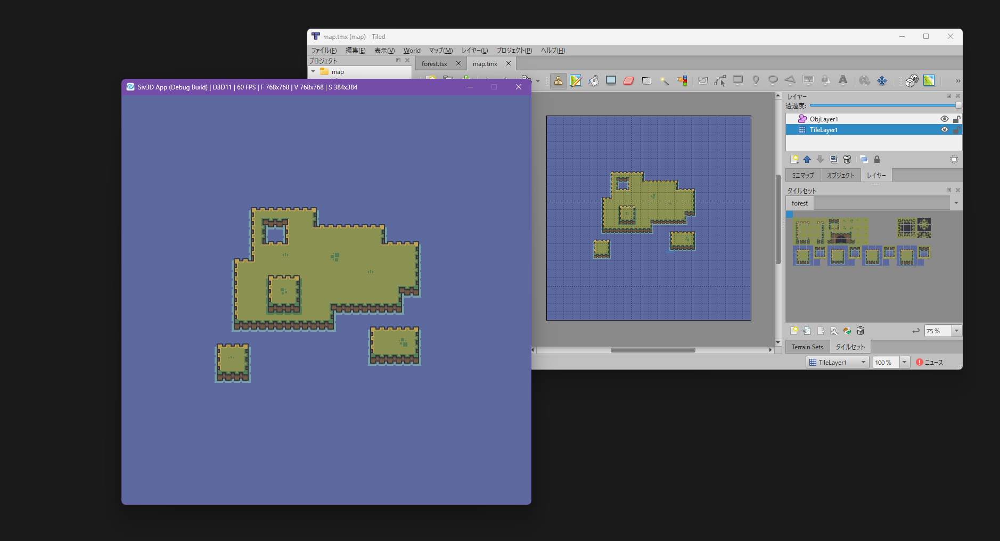

# read_tmx

[Siv3D](https://siv3d.github.io/ja-jp/) アプリで、[Tiled Map Editor](https://thorbjorn.itch.io/tiled) のマップ（.tmx ファイル）とタイルセット（ .tsx ファイル）を読み込んで表示するサンプルです。

タイルセット画像として [fantasy_](https://kevins-moms-house.itch.io/fantasy) を使用しています。

## 開発環境
- Visual Studio 2022 17.11.5
- Siv3D v0.6.15
- Tiled 1.11.0
